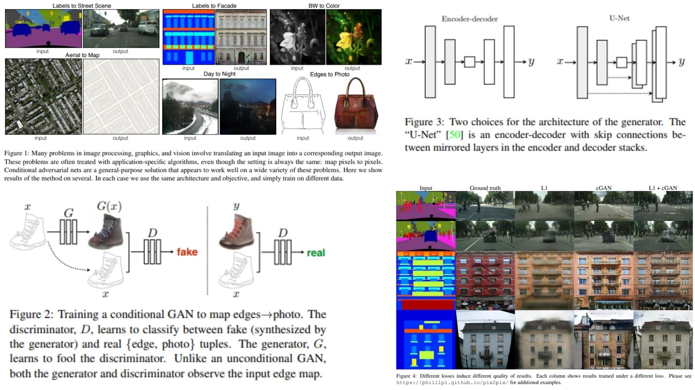

# 🎨 Pix2Pix-Replication — Conditional GANs for Image-to-Image Translation

This repository provides a **faithful Python replication** of the **Pix2Pix framework** for **image-to-image translation using conditional adversarial networks**. The code implements the pipeline described in the original paper, including **U-Net generator with skip connections, PatchGAN discriminator, and combined L1 + adversarial loss**.

Paper reference: *[Image-to-Image Translation with Conditional Adversarial Networks](https://arxiv.org/abs/1611.07004)*

---

## Overview 🌌



> The pipeline takes an **input image**, passes it through a **U-Net generator**, evaluates realism with a **PatchGAN discriminator**, and computes a **combined L1 + adversarial loss** to update both networks.

Key points:

- **Input image** — source image to translate:  

$$
x \in \mathbb{R}^{H \times W \times C}
$$

- **Generator (U-Net)** — maps input to output while preserving spatial information via **skip connections**:  

$$
\hat{y} = G(x)
$$

- **Discriminator (PatchGAN)** — classifies whether each **N×N patch** in the output is real or fake, conditioned on input:  

$$
D(x, y) \in [0,1]^{M \times M} \quad \text{where M depends on patch size}
$$

- **Conditional GAN loss** — adversarial objective for generator and discriminator:  

$$
\mathcal{L}_{\text{cGAN}}(G, D) = \mathbb{E}_{x,y}[\log D(x, y)] + \mathbb{E}_{x}[\log(1 - D(x, G(x)))]
$$

- **L1 reconstruction loss** — encourages generator outputs close to ground truth:  

$$
\mathcal{L}_{L1}(G) = \mathbb{E}_{x,y}[\|\hat{y} - y\|_1]
$$

- **Total objective** — weighted combination:

$$
\mathcal{L}_{\text{total}} = \lambda \cdot \mathcal{L}_{L1}(G) + \mathcal{L}_{\text{cGAN}}(G, D)
$$

---

## Why Pix2Pix Matters 🌿

- Learns **high-quality mappings between images**  🖼️  
- Uses **GANs** to adapt the loss to the data distribution  
- **U-Net + PatchGAN** combination produces **sharp, realistic outputs**  
- Applicable to **a variety of tasks**, e.g., edges→photo, labels→photo, maps→aerials  

---

## Repository Structure 🏗️

```
Pix2Pix-Replication/
├── src/
│   ├── backbone/
│   │   ├── generator_unet.py          
│   │   ├── discriminator_patchgan.py  
│   │   └── blocks.py                  
│   │
│   ├── layers/
│   │   ├── downsample.py           
│   │   └── upsample.py            
│   │
│   ├── loss/
│   │   └── cgan_loss.py            
│   │
│   ├── model/
│   │   └── pix2pix_pipeline.py       
│   │
│   └── config.py                   
│
├── images/
│   └── figmix.jpg               
│
├── requirements.txt
└── README.md
```

---

## 🔗 Feedback

For questions or feedback, contact:  
[barkin.adiguzel@gmail.com](mailto:barkin.adiguzel@gmail.com)
